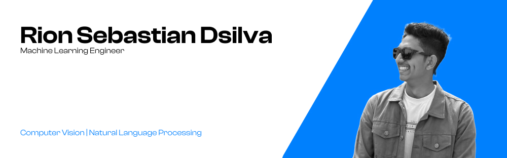

# 💫 About Me:

🔭 Currently working as Machine Learning Engineer Intern [@Proglint Software Solutions](https://www.proglint.com/) 
👯 Always ready to collbrate for solving real world problem 
🌱 Studying @VIT-AP university as B.Tech in Computer Science Student 

# 📊 GitHub Stats:

## 🌐Socials

  
